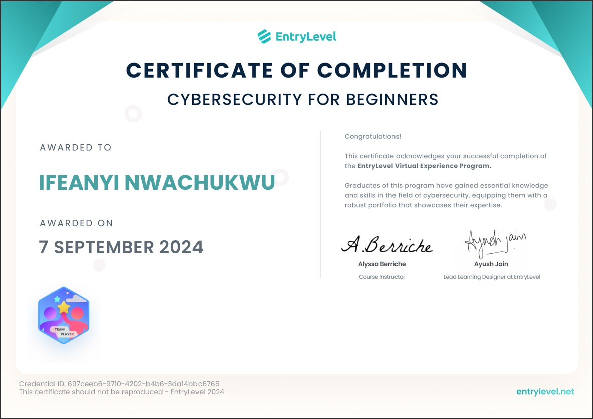
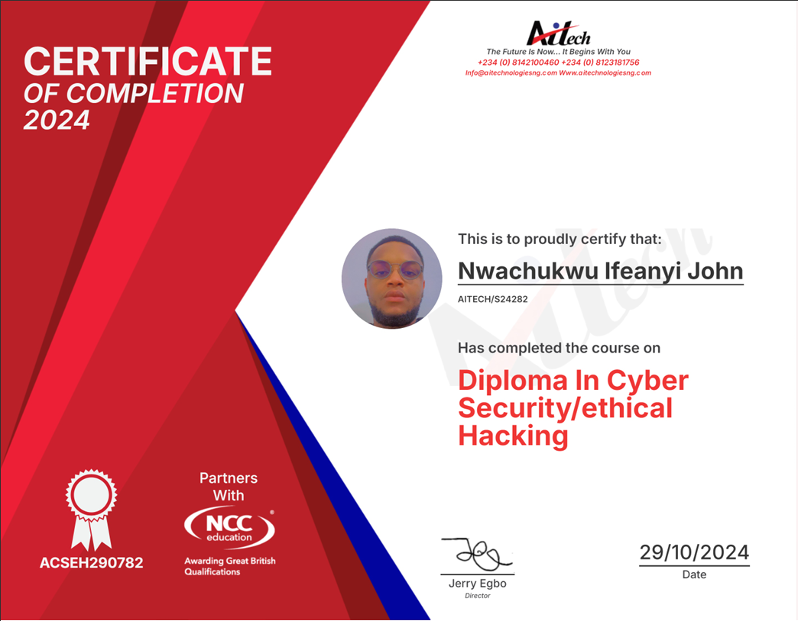
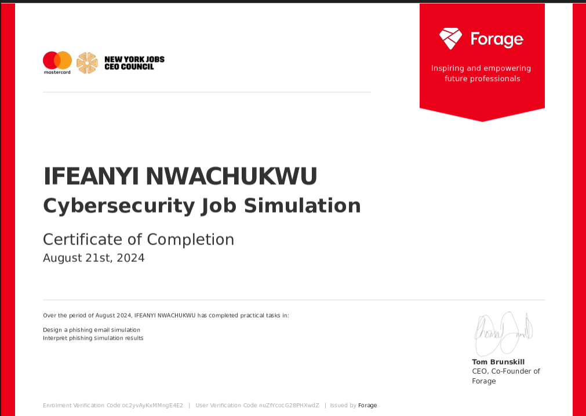
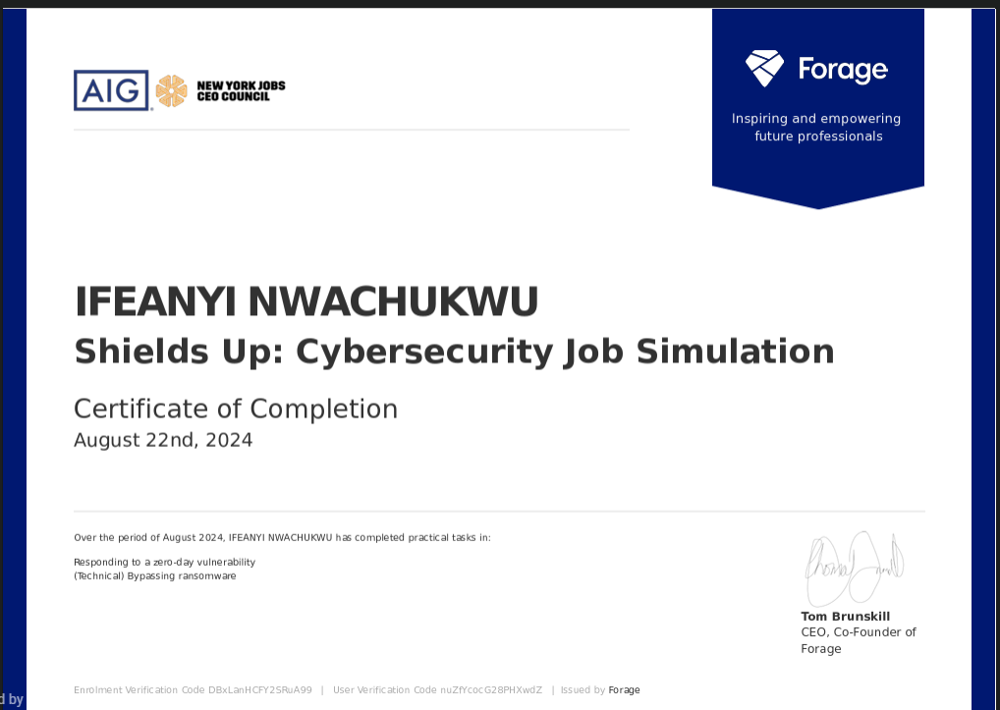
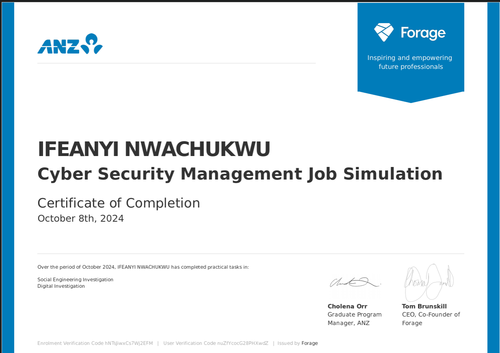

# Hi, I'm Ifeanyi Nwachukwu 

### Cybersecurity Professional | Penetration Tester | Security Analyst

I am a cybersecurity practitioner focused on [defensive security / offensive security / threat hunting]. I specialize in identifying vulnerabilities, analyzing threats, and implementing robust security measures to protect critical infrastructure.

## Skills & Tools
* **Security Domains:** Ethical Hacking, Network Security, Vulnerability Assessment, Incident Response
* **Tools:** Nmap, Wireshark, Burp Suite, Metasploit, Splunk
* **Languages:** Python, Bash, SQL

## Certifications & Job Simulations

### Foundational Certifications
| EntryLevel - Cybersecurity for Beginners | Aitech - Diploma in Cyber Security/Ethical Hacking |
| :---: | :---: |
|    *(See [Recommendation Letter](./assets/certificates/Entrylevel-letter.png))* |  |

### Job Simulations
| Mastercard Cybersecurity | AIG Shields Up | ANZ Cyber Security Management |
| :---: | :---: | :---: |
|  |  |  |

## Projects

## 📝 Technical Write-ups & Methodology
* **[Advanced Google Search: Notes From Actually Using It](./writeups/osint/advanced-google-search.md)** - A practical breakdown of Google Dorking for OSINT, detailing undocumented operators, search methodology, and the filtering mindset required for effective passive reconnaissance.
* **[Project Name 2]**: Brief description of the vulnerability assessment or script.

## Connect with me
* LinkedIn: [Your LinkedIn Profile URL](https://linkedin.com/in/username)
